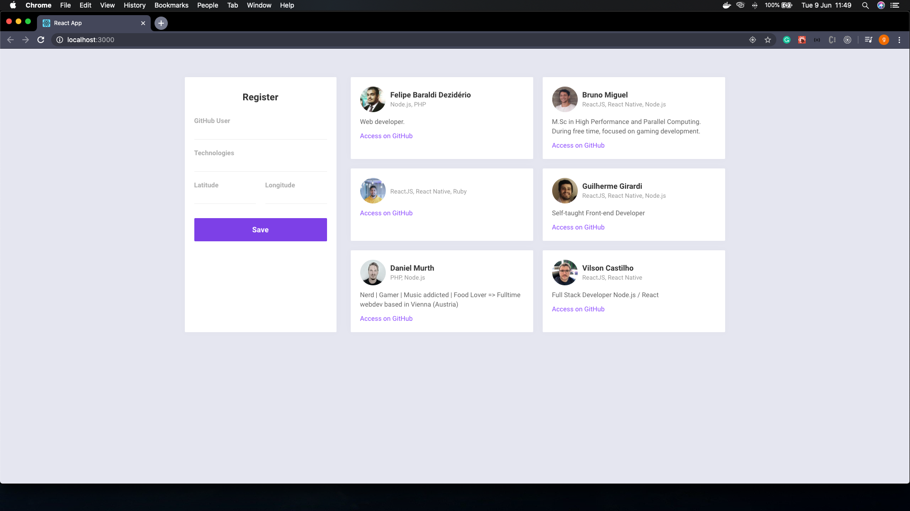

# DevRadar-Frontend

This is the frontend of the **DevRadar** project developed by [**_Rocketseat_**](https://rocketseat.com.br/), a Brazilian company that teaches Node.JS, ReactJS and React Native.
This is a project where I could learn many professional techniques that is used in "the real world".

## About the project

- The **DevRadar** is an application where you can search for developers within 10km around you.

## The frontend

The frontend was developed with [**_ReactJS_**](https://reactjs.org/) using [**_axios_**](https://www.npmjs.com/package/axios) for the http requests.
[**_react-router-dom_**](https://www.npmjs.com/package/react-router-dom) was used to handle the routes in this application and [**_socket.io_**](https://socket.io/) to connect the requests from the mobile to the web in real-time.

**Login**

## Getting started

1.  Prerequisites

- npm

      npm install npm@latest -g

2. Installation

- Clone the repo

      git clone https://github.com/euguilhermegirardi/DevRadar-Frontend.git

3. Install NPM packages

       npm install

4. Run the application

       npm run start

## Contributing

1.  Fork the project
2.  Create your feature branch (`git checkout -b feature/AmazingFeature`)
3.  Commit your changes (`git commit -m 'Add some AmazingFeature'`)
4.  Push to the branch (`git push origin feature/AmazingFeature`)
5.  Open a pull request

## License

